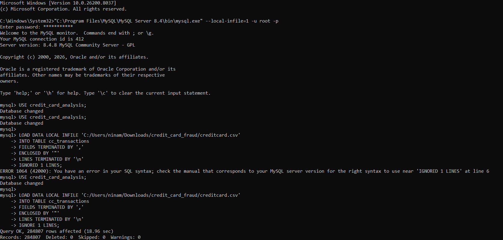

# Financial Risk Analysis: Credit Card Fraud Detection
**Data Source:** [Credit Card Fraud Detection (Kaggle)](https://www.kaggle.com/datasets/mlg-ulb/creditcardfraud)

---

## Project Overview
This project identifies fraudulent financial transactions using a dataset of **284,807 records**. The goal was to demonstrate an end-to-end analytical workflow: moving from high-speed data ingestion to deep-dive risk profiling using SQL.

## The Technical Journey:
When starting this project, I hit a common roadblock: the standard MySQL Workbench "Import Wizard." 

* **The Problem:** The GUI was incredibly slow, processing rows one by one. For a dataset of this size, it was inefficient and prone to timeouts.
* **The Solution:** I shifted to the **Command Line Interface (CLI)** to perform a bulk data ingestion.
  
* **The Struggle:** This required troubleshooting `local_infile` security settings, fixing "Strict Mode" constraints, and resolving system file pathing conflicts.
* **The Result:** By using `LOAD DATA LOCAL INFILE` via the terminal, I bypassed the GUI limitations and completed the data import in **under 30 seconds**.



---

## SQL Analysis & Business Insights

### 1. Verification
Once the data was loaded via CMD, I verified the integrity of the import by calculating the fraud-to-normal ratio.

```sql
SELECT 
    Class, 
    COUNT(*) AS total, 
    ROUND(COUNT(*) * 100.0 / (SELECT COUNT(*) FROM cc_transactions), 2) AS percentage
FROM cc_transactions 
GROUP BY Class;
```
The Result: Only 0.19% of transactions were fraudulent. This matches industry benchmarks for imbalanced datasets and confirms the data is ready for analysis.

### 2. Finding Temporal Patterns
I transformed the raw Time data (seconds) into a 24-hour clock to identify "Peak Vulnerability" hours where fraud is most frequent.

```SQL
SELECT 
    FLOOR(Time/3600) % 24 AS hour_of_day, 
    COUNT(*) AS fraud_count
FROM cc_transactions 
WHERE Class = 1
GROUP BY hour_of_day 
ORDER BY fraud_count DESC 
LIMIT 5;
```
### 3. Identifying High-Value Outliers
I filtered for "High-Impact" fraudulent transactions exceeding $1,000. While rare, these represent the highest immediate financial risk to the institution.
```
SQL
SELECT * FROM cc_transactions
WHERE Class = 1 AND Amount > 1000
ORDER BY Amount DESC;
```

### Repository Structure
* fraud_analysis_queries.sql: Full SQL script including table creation and analysis queries.
* bulk_data_load_success.png: Documentation of CLI ingestion.
* fraud_ratio_results.png: Visual proof of analytical query output.
* README.md: Project documentation and technical narrative.
